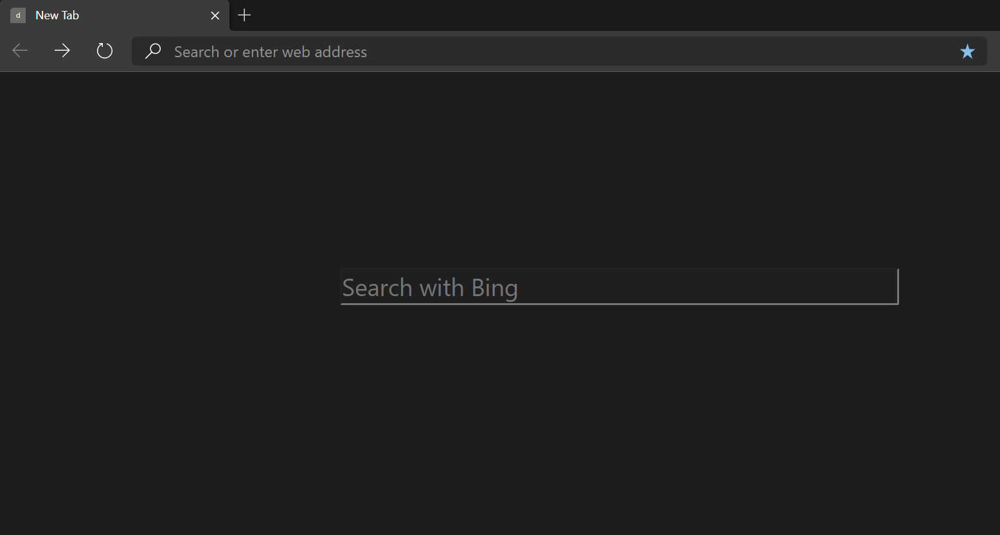

# edge-darknewtab

**Why edge-darknewtab?**

I just installed the latest Chromium based Edge browser and discovered that there was a lot of distraction especially regarding links to websites I had no business connecting to. 

Despite searching for a way to disable these in the settings, I found none. I therefore decided to create my own extension to solve that problem. 

**NOTE**:

1. This extension can work on any Chromium based. The name is just to indicate that the repository was Edge inspired.

2. The search bar currently uses bing as the search engine. You can override this by editing the darknewtab.html file. In most cases, this may be unnecessary since you can still use the top address bar which uses your default search engine. Future releases may make this more flexible.


**Installation**

```
git clone https://github.com/Nelson-Gon/edge-darknewtab.git

```
**Enabling the extension**

1. Open Edge(the new Chromium based Edge)

2. Go to Extensions(click the three dots in the top right corner)

3. On the Extensions page, toggle to **enable Developer Mode**.

4. Click **Load Unpacked** and choose the directory that you just cloned(ie edge-darknewtab).

5. Enjoy a distraction free new tab. :)


**Result**


