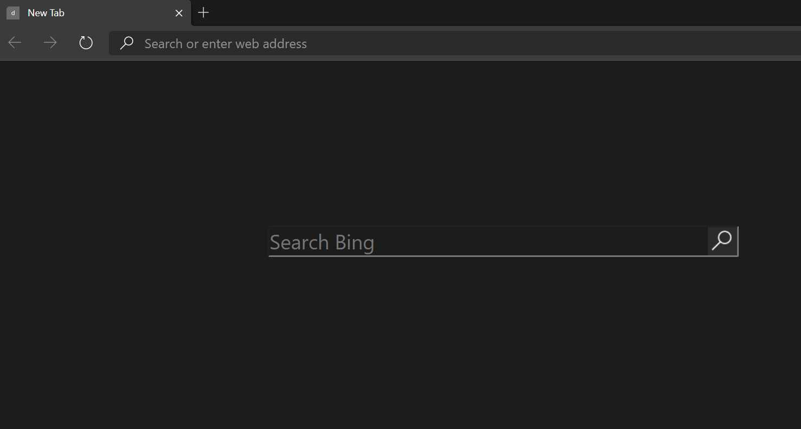

# darknewtab

**Why darknewtab?**

I just installed the latest Chromium based Edge browser and discovered that there was a lot of distraction especially regarding links to websites I had no business connecting to. 

Despite searching for a way to disable these in the settings, I found none. I therefore decided to create my own extension to solve that problem. 

**NOTE**: 

This extension currently **connects to Bing** although this can easily be changed by editing the darknewtab.html file(basically just change Bing to Google)

**Installation**

```
git clone https://github.com/Nelson-Gon/darknewtab

```

Once that is done, open Edge(the new Chromium based Edge), go to Extensions and enable Developer Mode.

Next, load the extension by clicking "Load Unpacked" and finally choose the directory that you just cloned(ie darknewtab).

That's it! You now have a dark new tab enabled.

**Result**


